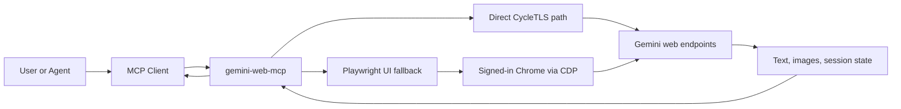

<div align="center">

# Gemini Web MCP

**Use a real Gemini web session from any MCP-compatible agent. 🍌**

Direct `CycleTLS` first. Playwright fallback when the browser UI is actually required.

[](https://github.com/minanagehsalalma/gemini-web-mcp/actions/workflows/ci.yml)
[](./LICENSE)


[Quickstart](#quickstart) •
[Why It Wins](#why-it-wins) •
[Compatibility](#compatibility) •
[Architecture](#architecture) •
[Tools](#main-tools)

</div>

## The Pitch

`gemini-web-mcp` is an unofficial MCP server that turns a manually signed-in `gemini.google.com` browser session into a reusable tool for any agent or MCP client.

🍌 It can also be used as a Nano Banana-style MCP for Gemini image generation and image-to-image workflows when you want that surface exposed through a general MCP bridge instead of a client-specific wrapper.

It is not a thin browser script and it is not a Codex-only wrapper.

The repo is built around a sharper split:

- Use direct `CycleTLS` transport for fresh text-to-image requests
- Fall back to Playwright only when Gemini's browser UI is the source of truth
- Keep the session operational with attachment control, visible-image capture, diagnostics, and optional watermark cleanup
- Expose Gemini image-generation flows in a form that can work as a Nano Banana-style MCP for compatible agent stacks

## Why It Wins

<table>
  <tr>
    <td width="33%">
      <strong>Direct-first transport</strong><br />
      Fresh text-to-image work does not have to pay the full browser-automation tax.
    </td>
    <td width="33%">
      <strong>Any MCP client</strong><br />
      The core product is the MCP server, not a wrapper around one agent runtime.
    </td>
    <td width="33%">
      <strong>UI fallback when needed</strong><br />
      Image-to-image, attachment reuse, and style-picker flows still work when the browser is required.
    </td>
  </tr>
  <tr>
    <td width="33%">
      <strong>Session-aware tooling</strong><br />
      Inspect state, manage attachments, save visible outputs, and avoid blind retries.
    </td>
    <td width="33%">
      <strong>Operational output handling</strong><br />
      Capture generated images, detect Gemini watermarks, and optionally clean saved PNGs.
    </td>
    <td width="33%">
      <strong>Honest boundaries</strong><br />
      Manual sign-in only, no pasted cookies, no billing-bypass claims, no fake API stability story.
    </td>
  </tr>
</table>

## At A Glance

| Surface | Best for | Notes |
|---|---|---|
| Direct transport | Fresh text-to-image | Fastest path, uses `CycleTLS` first |
| UI transport | Image-to-image and browser-only flows | Uses Playwright over the signed-in Chrome session |
| MCP server | Any compatible agent/client | stdio entrypoint, not tied to one host |
| Optional skill layer | Codex/OpenAI environments | Included, but not required |

## Quickstart

### 1. Install dependencies

```powershell
npm install
```

### 2. Point the repo at [CycleTLS-Parity](https://github.com/minanagehsalalma/CycleTLS-Parity)

```powershell
$env:GEMINI_WEB_CYCLETLS_JS_PATH="E:\path\to\CycleTLS-Parity\dist\index.js"
$env:GEMINI_WEB_CYCLETLS_EXE_PATH="E:\path\to\CycleTLS-Parity\dist\index.exe"
```

Fallback behavior:

- First try the env vars above
- Then try `vendor/CycleTLS-Parity/dist/...`
- Then fall back to the standard `cycletls` package

### 3. Launch the dedicated Gemini profile

```powershell
npm run launch:profile
```

Sign in manually in the visible Chrome window and keep Gemini open.

### 4. Run the MCP server

```powershell
node ".\scripts\gemini-web-mcp.mjs"
```

For a Codex CLI registration example, see [examples/codex-mcp-setup.md](./examples/codex-mcp-setup.md).

## Compatibility

| Client type | Status | Notes |
|---|---|---|
| Codex CLI | Supported | Optional example included in this repo |
| Claude Desktop | Compatible in principle | Use the stdio MCP entrypoint |
| Custom MCP agents | Supported | Best fit for teams that want the raw MCP server |
| Non-MCP clients | Not the target | Wrap the server rather than the browser session |

## Proof

This repo already ships the surfaces that usually get left out of unofficial browser bridges:

- Direct streamed image-request handling with ranked candidate selection
- Browser-state diagnosis instead of blind retry loops
- Attachment inventory and cleanup for image-to-image work
- Visible-image save flows without re-prompting
- Optional Gemini watermark detection and cleanup

Example of the kind of direct result metadata the MCP returns:

```json
{
  "transport": "direct",
  "imageUrlCount": 2,
  "selectedCandidate": {
    "mimeType": "image/png",
    "width": 1408,
    "height": 768,
    "score": 56
  },
  "downloadTransport": "cycletls"
}
```

## Architecture



### Two execution modes

#### Direct path

Used for simple fresh text-to-image requests.

1. Read current Gemini bootstrap data from the signed-in browser session
2. Reuse a cached request template captured from a real Gemini UI request
3. Send the request through `CycleTLS`
4. Parse the streamed response incrementally
5. Rank returned image candidates
6. Download the preferred result through the same browser-like transport

#### UI path

Used when the request depends on browser-only behavior.

1. Attach to the dedicated signed-in Chrome profile over CDP
2. Inspect the current Gemini state
3. Clear or preserve attachments intentionally
4. Upload reference images when needed
5. Fill the composer, submit, and wait for image creation to finish
6. Save the newest visible output or any explicitly selected visible image

## Main Tools

| Tool | Purpose |
|---|---|
| `check_status` | Verify login state, prompt surface, and direct-template cache readiness |
| `inspect_state` | Get diagnosis, confidence, recommendation, and visible-image context |
| `ask_gemini` | Send text/chat through the signed-in web session |
| `generate_image_ui` | Direct-first image generation with UI fallback |
| `list_attachments` / `clear_attachments` | Manage image-to-image context |
| `list_visible_images` / `save_visible_images` | Save existing outputs without re-generating |
| `detect_watermark_file` / `remove_watermark_file` | Work with saved Gemini PNG outputs |

## What This Is Not

- Not an official Gemini API wrapper
- Not a cookie-import tool
- Not a billing bypass
- Not a promise that Google will keep the same web endpoints or selectors forever

## Repo Layout

```text
assets/      repo visuals
agents/      optional OpenAI/Codex skill metadata
docs/        architecture and usage notes
examples/    client and registration examples
references/  source notes from the original exploration
scripts/     MCP server, launcher, and watermark utilities
SKILL.md     optional Codex skill instructions
```

## Optional Codex Skill

This repo includes a Codex skill because Codex is a useful MCP client, not because the project is Codex-only.

If you want the skill form, use [SKILL.md](./SKILL.md). If you only want the MCP server, the repo already stands on its own.

## Safety Notes

- Use a dedicated browser profile for Gemini
- Treat this as an unofficial bridge, not a supported API
- Keep sensitive local outputs out of the repo
- Ask the user to handle login, CAPTCHA, quota, or consent screens manually
- Do not add cookie-import flows

## Docs

- [Architecture Notes](./docs/architecture.md)
- [Technical Deep Dive](./docs/technical.md)
- [Client Setup Example](./examples/codex-mcp-setup.md)
- [Optional Codex Skill](./SKILL.md)

## License

MIT
